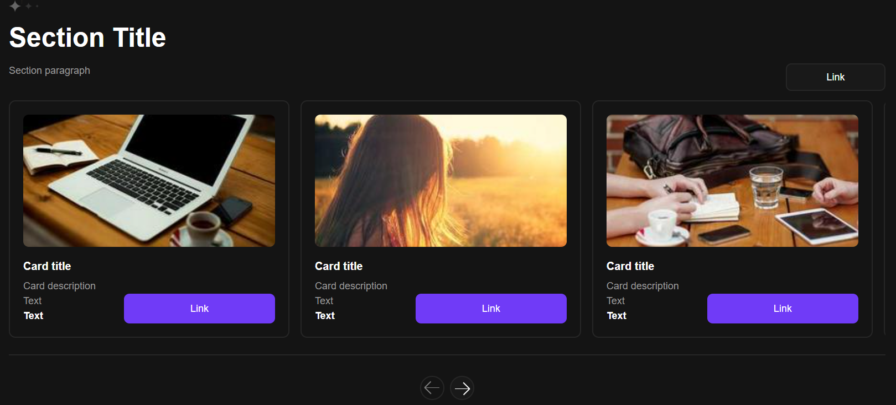
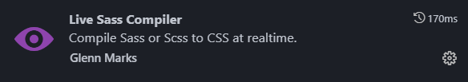

# Swiper 

Swiper is a script that allows you to cyclically change content built on the basis of CSS and JavaScrip.

>In view of the demand for a swiper in website development, I decided to make it easier for you to write your own script and am sharing with you a ready-made swiper that you can use in your project, changing it to suit your requirements.
 
When you press the "right" button, the swiper moves one slide to the left and vice versa when you press the "left" button.

***This code is adapted for all devices.***

**Method:** *mobile-first;*

**Breakpoints:**
* *768px;*
* *1024px;*
* *1440px;*
* *1920px;*

**How to set different values ​​for breakpoints:**

**[==> Click me](./assets/docs/BREAKPOINTS.md)**

>I have also added comments in important parts of the code for your ease of use.

## Summary

* [Philosophy 🧑‍🎓](#philosophy)
* [Licence ⚖️](#licence)
* [Tools 🛠️](#tools)
* [Installation 🖥️](#installation)
* [Contacts 📲](#contact-me)

## Philosophy

[KISS 💋](https://en.wikipedia.org/wiki/KISS_principle)

## Licence

Was created under the [MIT Licence ⚖️](./LICENSE)

## Tools

* HTML 
* SCSS 
* JS 

## Installation

You can download the 🧰**release** of this project.

------------------------**OR**-------------------------

To work with this project you will need **GIT**.

**[==>How to install Git](https://git-scm.com/book/en/v2/Getting-Started-Installing-Git)**

You can use SCSS  or CSS  code.

❗️To use SCSS you need to install SASS.

**[==>How to install SASS](https://sass-lang.com/install/)**

❓If you work in VSCode, you can use the plugin without installing SASS.

### Local installation:

On the command line, navigate to the folder where the project will be deployed. Then copy it from GitHub :

`git clone https://github.com/saintgregoire/Swiper.git`

## Contact me

>**If you have any questions you can always open new issue in this repo.**